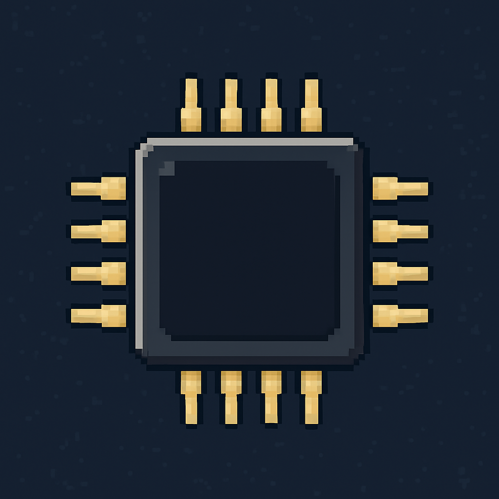
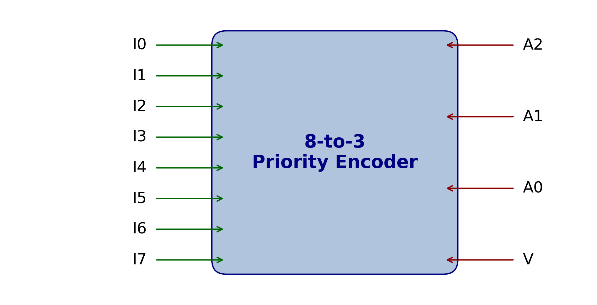

# Priority Encoder



## Introduction

A **priority encoder** is a combinational logic circuit that solves a common
problem with ordinary encoders: when two or more inputs become active
simultaneously it is unclear which input should be encoded.  In a standard
encoder only one input may be active at a time; in practical systems two or
more keys or interrupt requests can be asserted together.
A priority encoder assigns a fixed priority to each input and produces a
binary code corresponding to the *highest‑priority* active input.  It outputs
an **n‑bit code** along with a **valid flag** that indicates whether any
input is active【41287155402778†L354-L359】.  If multiple inputs are high the
encoder ignores all lower‑priority inputs and arbitrates to select the
highest priority.

Typical digital systems employ priority encoders for tasks such as keyboard
scan coding, interrupt handling and bus arbitration; for example, if keys 4
and 2 are pressed simultaneously the priority encoder will encode 4
instead of producing an invalid code.

## Features

* **Fixed priority scheme.**  Inputs are ordered by their numeric value; the
  highest numbered input has the highest priority.  For a 4‑input encoder
  the input `I3` has the highest priority, followed by `I2`, `I1` and
  finally `I0`.
* **Valid flag.**  The output includes a valid bit `V` that is set to `1`
  when one or more inputs are high and `0` otherwise.
  When `V` is zero the other outputs are don’t‑care values.
* **Arbitration.**  The encoder performs arbitration among multiple active
  inputs and selects only the highest priority input.
* **Scalable architecture.**  Priority encoders can be built for any number
  of inputs.  A common configuration is the **8‑to‑3 encoder** which has eight
  inputs and three binary outputs.

## Architecture

The priority encoder can be implemented using combinational logic.  The
figure below shows a high‑level block diagram of an **8‑to‑3 priority encoder**.
Eight input lines (`I0`–`I7`) feed a combinational network that produces
three binary outputs (`A2`, `A1`, `A0`) and a valid flag `V`.  Only the
highest‑priority asserted input influences the outputs.  Inputs with lower
priority are ignored.



The boolean equations for a 4‑input priority encoder illustrate how the
priority scheme works.  For inputs `I0`–`I3` the outputs `A` and `B`
represent the binary code of the active input and `V` is the OR of all
inputs:

\[
\begin{aligned}
A &= I_3 + I_2 \\
B &= I_3 + \bar{I_2} I_1 \\
V &= I_3 + I_2 + I_1 + I_0
\end{aligned}
\]【41287155402778†L382-L390】

## Truth Table

The table below shows the truth table of a **4‑to‑2** priority encoder.  The
“X” entries are don’t‑care values.  The valid bit `V` is set when at least
one input is high; when all inputs are zero the outputs `A` and `B` are
undefined.

| `I3` | `I2` | `I1` | `I0` | `A` | `B` | `V` | Description |
|----|----|----|----|----|----|----|-------------|
| 0 | 0 | 0 | 0 | X | X | 0 | No valid input |
| 0 | 0 | 0 | 1 | 0 | 0 | 1 | `I0` active |
| 0 | 0 | 1 | X | 0 | 1 | 1 | `I1` active (priority over `I0`) |
| 0 | 1 | X | X | 1 | 0 | 1 | `I2` active |
| 1 | X | X | X | 1 | 1 | 1 | `I3` active (highest priority) |


## Example Implementation (Verilog)

Below is a simple Verilog implementation of an **8‑to‑3 priority encoder**
with a valid output.  The `always` block uses a `casex` statement to
examine the input vector from highest to lowest priority.

```verilog
// 8‑to‑3 Priority Encoder with valid flag
module priority_encoder8 (
    input  wire [7:0] in,
    output reg  [2:0] code,
    output reg        valid
);
    always @* begin
        casex (in)
            8'b1???_????: begin code = 3'b111; valid = 1'b1; end // I7
            8'b01??_????: begin code = 3'b110; valid = 1'b1; end // I6
            8'b001?_????: begin code = 3'b101; valid = 1'b1; end // I5
            8'b0001_????: begin code = 3'b100; valid = 1'b1; end // I4
            8'b0000_1???: begin code = 3'b011; valid = 1'b1; end // I3
            8'b0000_01??: begin code = 3'b010; valid = 1'b1; end // I2
            8'b0000_001?: begin code = 3'b001; valid = 1'b1; end // I1
            8'b0000_0001: begin code = 3'b000; valid = 1'b1; end // I0
            default: begin code = 3'bxxx; valid = 1'b0; end       // No inputs
        endcase
    end
endmodule
```

### Simulation

To verify the encoder you can create a testbench that cycles through
different input vectors and observes the outputs.  Here is a minimal testbench
using Icarus Verilog:

```verilog
module tb_priority;
    reg  [7:0] in;
    wire [2:0] code;
    wire       valid;

    priority_encoder8 dut (.in(in), .code(code), .valid(valid));

    initial begin
        $display("in\tcode valid");
        // Apply each input bit one at a time
        in = 8'b00000001; #10;
        $display("%b\t%b %b", in, code, valid);
        in = 8'b00000010; #10;
        $display("%b\t%b %b", in, code, valid);
        // Multiple bits high – highest priority should be encoded
        in = 8'b10010010; #10;
        $display("%b\t%b %b", in, code, valid);
        in = 8'b00000000; #10;
        $display("%b\t%b %b", in, code, valid);
        $finish;
    end
endmodule
```

Compile and run the simulation using Icarus Verilog:

```bash
iverilog -g2012 -o tb_priority tb_priority.v priority_encoder8.v
vvp tb_priority
```

## Applications

Priority encoders are used in many digital subsystems:

* **Interrupt controllers:** determine which interrupt request line has the
  highest priority and vector the processor accordingly.
* **Keyboards and keypads:** encode the highest‑priority pressed key to
  avoid ghosting when multiple keys are pressed simultaneously.
* **Bus arbitration:** select one of many peripheral devices requesting use
  of a shared bus.

## Contributing

Contributions are welcome!  You can suggest improvements, add support for
parameterised input widths or provide testbenches for other hardware
description languages.  Please open an issue or submit a pull request.

## License

This project is released under the **MIT License**.  The custom diagram
`priority_encoder_diagram.png` and the pixel‑art hero image are released
under the same license.  The information in this README draws on open
educational resources【41287155402778†L309-L325】【41287155402778†L354-L359】 for
illustrative purposes.
